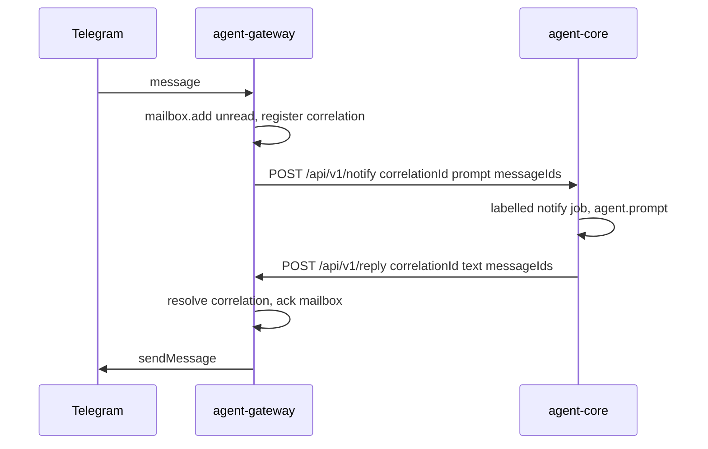
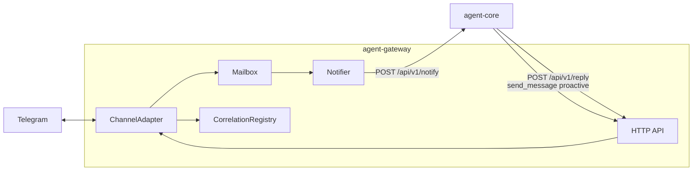

# Gateway specification

Normative behaviour for **agent-gateway**: the bidirectional edge between external channels (Telegram today; email and others later) and **agent-core** digital workers.

**TypeScript source of truth:** `@digital-worker/agent-gateway-protocol` (gateway HTTP) and `@digital-worker/agent-core-protocol` (`/api/v1/notify` ingress).

**Implementation:** `apps/agent-gateway`

**Related:** [agent-core-api](./agent-core-api.md), [worker-runtime](./worker-runtime.md), [system-overview](../system-overview.md)

## Purpose

agent-gateway is a separate OS process that:

1. **Listens** on external channels via pluggable **channel adapters**.
2. **Stores** inbound messages in a **mailbox** for durability and audit.
3. **Forwards** each inbound message to agent-core with a **correlation id** for automatic reply routing.
4. **Delivers** the worker's assistant reply back to the originating conversation via `POST /api/v1/reply`.

The worker replies in text; delivery to the external channel is automatic — no tool call required for the current conversation.

## Correlation auto-reply model

| Concept | Meaning |
|---------|---------|
| **correlationId** | `channel:threadId` (e.g. `telegram:123456789`) — identifies a conversation |
| **Inbound** | Gateway POSTs message text + correlation to `/api/v1/notify` (202) |
| **Turn** | agent-core labels the prompt `[conversation … from …]` and runs a notify job |
| **Auto-reply** | Runtime accumulates assistant text and POSTs to `/api/v1/reply` |
| **Ack** | Gateway sends to Telegram and marks mailbox messages read |

Messages stay **unread until successfully delivered**. On startup, unread messages are replayed through the notifier.



## Components



| Component | Path | Role |
|-----------|------|------|
| `ChannelAdapter` | `apps/agent-gateway/src/channel-adapter.ts` | Pluggable inbound/outbound channel |
| `TelegramAdapter` | `apps/agent-gateway/src/telegram/adapter.ts` | Long-poll + sendMessage |
| `Mailbox` | `apps/agent-gateway/src/mailbox.ts` | Durable unread store |
| `CorrelationRegistry` | `apps/agent-gateway/src/correlation-registry.ts` | Maps correlationId → routing |
| `Notifier` | `apps/agent-gateway/src/notifier.ts` | Per-thread coalesced notify to agent-core |
| `GatewayStore` | `apps/agent-gateway/src/store/gateway-store.ts` | libSQL persistence for mailbox, correlations, Telegram offset |

## Gateway HTTP API

Base URL: `http://127.0.0.1:3002` (local) or `http://agent-gateway:3002` (Compose).

| Method | Path | Purpose |
|--------|------|---------|
| `GET` | `/health` | Liveness |
| `GET` | `/api/v1` | Service metadata |
| `GET` | `/api/v1/messages` | Pull unread messages (catch-up/audit) |
| `POST` | `/api/v1/ack` | Explicitly mark messages read |
| `POST` | `/api/v1/outbound` | Proactive/explicit outbound send |
| `POST` | `/api/v1/reply` | Auto-reply delivery from agent-core |

Constants: `GATEWAY_PATHS` in `@digital-worker/agent-gateway-protocol`.

### GET /api/v1/messages

**Query**

| Param | Meaning |
|-------|---------|
| `peek=true` | Return unread without marking read |

**Response 200**

```typescript
interface MessagesResponse {
  messages: InboundMessage[];
  unreadCount: number;
}

interface InboundMessage {
  id: string;
  channel: string;       // e.g. "telegram"
  sender: string;
  text: string;
  threadId?: string;     // chat/thread for reply routing
  receivedAt: string;    // ISO timestamp
  read: boolean;
}
```

Default (no `peek`): returned messages are marked **read**.

### POST /api/v1/ack

**Request**

```typescript
interface AckRequest {
  ids: string[];
}
```

**Response 200**

```typescript
interface AckResponse {
  acked: number;
}
```

### POST /api/v1/outbound

Explicit outbound send (proactive updates, cross-conversation). Not used for auto-replies.

**Request**

```typescript
interface OutboundRequest {
  channel: string;   // e.g. "telegram"
  text: string;
  threadId?: string;
}
```

**Response 200**

```typescript
interface OutboundResponse {
  delivered: boolean;
  providerMessageId?: string;
}
```

### POST /api/v1/reply

Auto-reply delivery from agent-core after a correlated notify job completes.

**Request**

```typescript
interface ReplyRequest {
  correlationId: string;  // e.g. "telegram:123456789"
  text: string;
  messageIds?: string[];  // mailbox ids to ack on success
}
```

**Response 200**

```typescript
interface ReplyResponse {
  delivered: boolean;
  providerMessageId?: string;
}
```

Returns **404** if `correlationId` is unknown, **502** if channel send fails.

## agent-core ingress: POST /api/v1/notify

Gateway forwards inbound messages asynchronously. See [agent-core-api](./agent-core-api.md#post-apiv1notify).

- Returns **202 Accepted** immediately.
- Enqueues a **notify** job with labelled prompt and auto-delivery sink when `correlationId` is present.
- Assistant text is POSTed back to `/api/v1/reply` on job completion.

## Worker tools

When `--gateway-url` (or `GATEWAY_URL`) is set, agent-core exposes:

| Tool | Maps to | When to use |
|------|---------|-------------|
| `check_messages` | `GET /api/v1/messages` | Catch-up / audit only |
| `send_message` | `POST /api/v1/outbound` | Proactive or other-conversation sends |

Replies to the current labelled turn are **automatic** — do not call `send_message` for those. The workspace `telegram` skill documents behaviour for the model.

## Channel adapter contract

```typescript
interface ChannelAdapter {
  readonly channel: string;
  start(onMessage: (message: NormalizedInbound) => void): Promise<void>;
  send(text: string, threadId?: string): Promise<{ providerMessageId?: string }>;
  stop(): Promise<void>;
}
```

New channels (email, webhooks) implement this interface and register at startup.

## Telegram adapter

- **Inbound:** long-poll `getUpdates` (no public webhook URL required).
- **Outbound:** `sendMessage` via Bot API with markdown converted to HTML (`parse_mode: HTML`); falls back to plain text if Telegram rejects the formatted payload.
- **Allowlist:** only messages from configured `TELEGRAM_ALLOWED_CHAT_IDS` enter the mailbox. Dropped chats are logged once per chat id (`chatId` + Telegram `chat.type`; message body is not logged). Group/supergroup ids are negative numbers — list them alongside private DM ids.
- **Group privacy:** Telegram may not deliver plain group messages unless Group Privacy is off in BotFather or the bot is @mentioned.
- **Offset:** persisted across restarts.

## Notification coalescing

1. Inbound message → mailbox (unread) + correlation registered → debounced notify per thread (500 ms default).
2. Notifier POSTs `/api/v1/notify` with combined text for burst messages on the same thread.
3. Messages marked in-flight until `/api/v1/reply` acks them.
4. On notify failure or delivery timeout, retry after `--renotify-interval-ms` (default 5 minutes).
5. On startup, replay any still-unread messages.

## Configuration

| Variable / flag | Required | Purpose |
|-----------------|----------|---------|
| `GATEWAY_TELEGRAM_BOTS_FILE` / `--telegram-bots-file` | yes* | Path to JSON array of bot routes |
| `GATEWAY_TELEGRAM_BOTS` / `--telegram-bots` | yes* | Inline JSON array (alternative to file) |
| `TELEGRAM_ALLOWED_CHAT_IDS` | yes | Comma-separated allowlisted chat IDs (shared by all bots). Private DMs use positive user ids; groups/supergroups use negative chat ids. |
| Per-bot `tokenEnv` | yes | Each config entry names an env var holding the Bot API token |
| `GATEWAY_LEGACY_BOT_ID` | no | Assign legacy mailbox rows/offsets without botId (default: first configured bot) |
| `GATEWAY_URL` | agent-core | Enables worker gateway tools + auto-reply client |
| `--db-url` / `LIBSQL_URL` | no | libSQL database URL |
| `--legacy-data-dir` | no | One-off import of legacy `state.json` |
| `--renotify-interval-ms` | no | In-flight retry interval (default 5 minutes) |

\* One of `GATEWAY_TELEGRAM_BOTS_FILE`, `GATEWAY_TELEGRAM_BOTS`, or legacy `TELEGRAM_BOT_TOKEN` (single default bot).

**Bot route JSON** (array):

```json
[
  {
    "botId": "aidadigitalbot",
    "tokenEnv": "TELEGRAM_AIDADIGITALBOT_TOKEN",
    "agentCoreUrl": "http://agent-core-aida:3000"
  },
  {
    "botId": "riaandigitalbot",
    "tokenEnv": "TELEGRAM_RIAANDIGITALBOT_TOKEN",
    "agentCoreUrl": "http://agent-core-riaan:3000"
  }
]
```

- `botId` — stable routing id (lowercase, hyphens); used in correlation ids and `send_message`
- `tokenEnv` — name of env var containing the secret token (preferred)
- `token` — inline token (tests only)
- `agentCoreUrl` — agent-core base URL for inbound notify

Dev-workstation ships `infra/dev-workstation/gateway-telegram-bots.json`; add a bot by editing that file and setting its `tokenEnv` in `.env`.

Secrets **must not** live in the workspace bind mount.

## Storage

**Current:** libSQL via `@libsql/client` (`GatewayStore`). Mailbox, correlation registry, and Telegram `getUpdates` offset survive process restarts.

| Table | Purpose |
|-------|---------|
| `gateway_message` | Inbound mailbox messages |
| `gateway_correlation` | correlationId → channel/thread/sender routing |
| `gateway_meta` | Telegram offset and schema version |

Docker dev-workstation connects to the central `libsql` service (`http://libsql:8080`). Local `pnpm dev` defaults to `file:./data/agent-gateway/gateway.db`.

See [shared-database.md](./shared-database.md).

**Retention:** In Docker dev-workstation, a nightly cron job (04:00 UTC) runs `prune-read-messages` and deletes **read** messages older than **30 days**. Unread messages are never pruned. Override with `GATEWAY_PRUNE_READ_DAYS`.

## Security

- Strict sender allowlist before messages reach the mailbox or worker.
- Gateway credentials in `.env` only; commit `.env.example` names only.
- Inbound channels are an attack surface — they feed the worker context and tools.

## Testing

- `apps/agent-gateway/src/mailbox.test.ts`
- `apps/agent-gateway/src/correlation-registry.test.ts`
- `apps/agent-gateway/src/telegram/adapter.test.ts`
- `apps/agent-gateway/src/notifier.test.ts`
- `apps/agent-gateway/src/server.test.ts`
- `apps/agent-core/src/tools/gateway-messages.test.ts`
- `apps/agent-core/src/notify.test.ts`
- `apps/agent-core/src/gateway-reply.test.ts`
