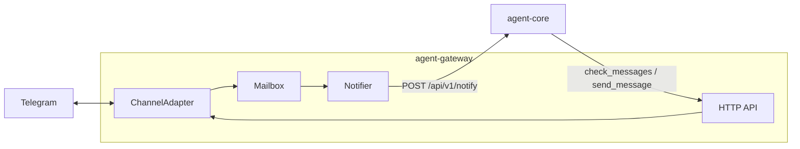

# Gateway specification

Normative behaviour for **agent-gateway**: the bidirectional edge between external channels (Telegram today; email and others later) and **agent-core** digital workers.

**TypeScript source of truth:** `@digital-worker/agent-gateway-protocol` (gateway HTTP) and `@digital-worker/agent-core-protocol` (`/api/v1/notify` ingress).

**Implementation:** `apps/agent-gateway`

**Related:** [agent-core-api](./agent-core-api.md), [worker-runtime](./worker-runtime.md), [system-overview](../system-overview.md)

## Purpose

agent-gateway is a separate OS process that:

1. **Listens** on external channels via pluggable **channel adapters**.
2. **Stores** inbound message content in a **mailbox** (gateway is system-of-record).
3. **Notifies** agent-core with a thin **doorbell** prompt — not the message payload.
4. **Serves** pull (`GET /api/v1/messages`) and push (`POST /api/v1/outbound`) APIs for the worker.

The worker decides when to pull messages and when to reply. Responsiveness is tuned in workspace `MANDATE.md`, not enforced by the transport.

## Doorbell / mailbox model

| Plane | Responsibility |
|-------|----------------|
| **Control** | Gateway → agent-core notification: "you have N new message(s) from …" |
| **Data** | Full message text stored in gateway mailbox until pulled |

Benefits:

- Keeps the worker transcript small (doorbell is cheap; payload enters context only on pull).
- Gives the worker agency to defer or batch.
- Same pattern extends to email and other async channels.

Safety net: if unread messages remain, the gateway **re-notifies** on an interval until the mailbox is drained or the worker pulls.

## Components



| Component | Path | Role |
|-----------|------|------|
| `ChannelAdapter` | `apps/agent-gateway/src/channel-adapter.ts` | Pluggable inbound/outbound channel |
| `TelegramAdapter` | `apps/agent-gateway/src/telegram/adapter.ts` | Long-poll + sendMessage |
| `Mailbox` | `apps/agent-gateway/src/mailbox.ts` | Unread store |
| `Notifier` | `apps/agent-gateway/src/notifier.ts` | Debounced doorbell to agent-core |
| `GatewayStore` | `apps/agent-gateway/src/store.ts` | Persist mailbox + Telegram offset |

## Gateway HTTP API

Base URL: `http://127.0.0.1:3002` (local) or `http://agent-gateway:3002` (Compose).

| Method | Path | Purpose |
|--------|------|---------|
| `GET` | `/health` | Liveness |
| `GET` | `/api/v1` | Service metadata |
| `GET` | `/api/v1/messages` | Pull unread messages |
| `POST` | `/api/v1/ack` | Explicitly mark messages read |
| `POST` | `/api/v1/outbound` | Send outbound message |

Constants: `GATEWAY_PATHS` in `@digital-worker/agent-gateway-protocol`.

### GET /api/v1/messages

**Query**

| Param | Meaning |
|-------|---------|
| `peek=true` | Return unread without marking read |

**Response 200**

```typescript
interface MessagesResponse {
  messages: InboundMessage[];
  unreadCount: number;
}

interface InboundMessage {
  id: string;
  channel: string;       // e.g. "telegram"
  sender: string;
  text: string;
  threadId?: string;     // chat/thread for reply routing
  receivedAt: string;    // ISO timestamp
  read: boolean;
}
```

Default (no `peek`): returned messages are marked **read**.

### POST /api/v1/ack

**Request**

```typescript
interface AckRequest {
  ids: string[];
}
```

**Response 200**

```typescript
interface AckResponse {
  acked: number;
}
```

### POST /api/v1/outbound

**Request**

```typescript
interface OutboundRequest {
  channel: string;   // e.g. "telegram"
  text: string;
  threadId?: string;
}
```

**Response 200**

```typescript
interface OutboundResponse {
  delivered: boolean;
  providerMessageId?: string;
}
```

## agent-core ingress: POST /api/v1/notify

Gateway notifies agent-core asynchronously. See [agent-core-api](./agent-core-api.md#post-apiv1notify).

- Returns **202 Accepted** immediately.
- Enqueues a **notify** job on the worker inbox (no SSE).
- Doorbell text becomes `agent.prompt()` input and enters the transcript.

## Worker tools

When `--gateway-url` (or `GATEWAY_URL`) is set, agent-core exposes:

| Tool | Maps to |
|------|---------|
| `check_messages` | `GET /api/v1/messages` |
| `send_message` | `POST /api/v1/outbound` |

Prefer tools over raw curl when available. The workspace `telegram` skill documents both.

## Channel adapter contract

```typescript
interface ChannelAdapter {
  readonly channel: string;
  start(onMessage: (message: NormalizedInbound) => void): Promise<void>;
  send(text: string, threadId?: string): Promise<{ providerMessageId?: string }>;
  stop(): Promise<void>;
}
```

New channels (email, webhooks) implement this interface and register at startup.

## Telegram adapter

- **Inbound:** long-poll `getUpdates` (no public webhook URL required).
- **Outbound:** `sendMessage` via Bot API.
- **Allowlist:** only messages from configured `TELEGRAM_ALLOWED_CHAT_IDS` enter the mailbox.
- **Offset:** persisted across restarts (Phase 2).

## Notification debounce

1. First unread message after mailbox was empty → schedule notify (500 ms debounce for bursts).
2. While a notification HTTP call is in flight → suppress additional notifies.
3. After notify completes, if unread remain → schedule re-notify after `--renotify-interval-ms` (default 5 minutes).

## Configuration

| Variable / flag | Required | Purpose |
|-----------------|----------|---------|
| `TELEGRAM_BOT_TOKEN` | yes | Bot API token (gateway only) |
| `TELEGRAM_ALLOWED_CHAT_IDS` | yes | Comma-separated allowlisted chat IDs |
| `AGENT_CORE_URL` | yes | agent-core base URL |
| `GATEWAY_URL` | agent-core | Enables worker gateway tools |
| `--data-dir` | no | Persisted mailbox state (default `./data/agent-gateway`) |
| `--use-notify-endpoint` | no | Use `/api/v1/notify` instead of `/api/v1/chat` |

Secrets **must not** live in the workspace bind mount.

## Security

- Strict sender allowlist before messages reach the mailbox or worker.
- Gateway credentials in `.env` only; commit `.env.example` names only.
- Inbound channels are an attack surface — they feed the worker context and tools.

## Testing

- `apps/agent-gateway/src/mailbox.test.ts`
- `apps/agent-gateway/src/telegram/adapter.test.ts`
- `apps/agent-gateway/src/notifier.test.ts`
- `apps/agent-gateway/src/server.test.ts`
- `apps/agent-core/src/tools/gateway-messages.test.ts`
- `apps/agent-core/src/notify.test.ts`
