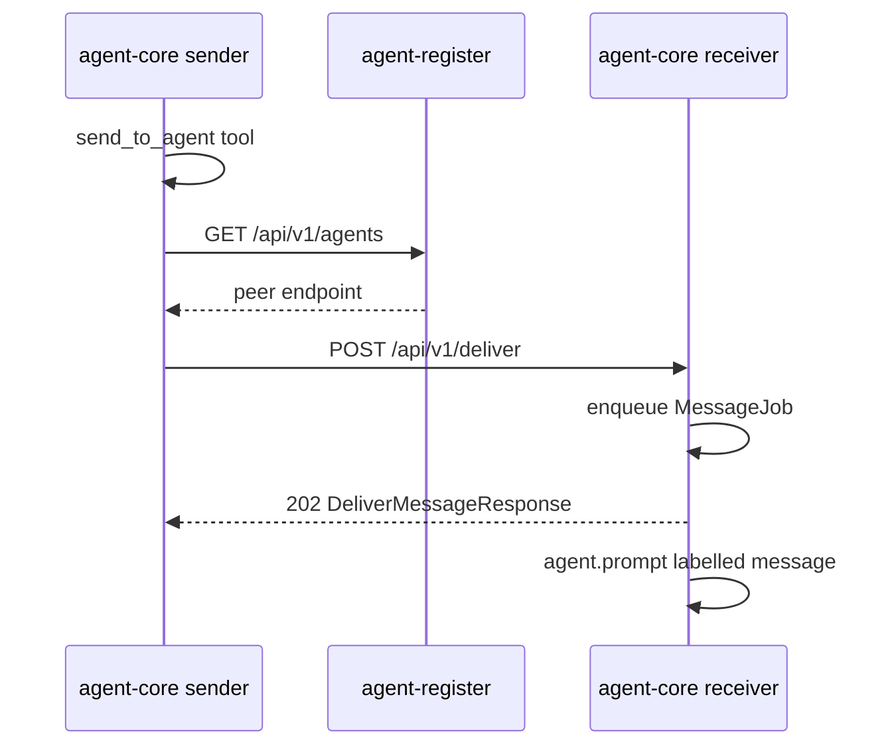

# Inter-agent message bus

Normative behaviour for worker-to-worker messaging between **agent-core** digital workers.

**TypeScript source of truth:** `@digital-worker/agent-core-protocol` (`message.ts`, `paths.ts`)

**Implementation:** `apps/agent-core/src/deliver.ts`, `apps/agent-core/src/tools/agent-messages.ts`

**Related:** [agent-core-api](./agent-core-api.md), [agent-register-api](./agent-register-api.md), [worker-runtime](./worker-runtime.md), [gateway](./gateway.md)

## Purpose

The inter-agent message bus lets one digital worker deliver work or context to another without direct human involvement. It is separate from **agent-gateway**, which handles external human channels (Telegram, email, …).

Each worker:

1. **Receives** inbound messages via `POST /api/v1/deliver` on its own HTTP server.
2. **Enqueues** them as labelled `MessageJob`s in the same FIFO inbox as chat and notify.
3. **Sends** outbound messages via the `send_to_agent` tool, resolving peers through **agent-register**.

Delivery is **fire-and-forget**: the receiver processes the message in its inbox; no automatic reply is routed back to the sender. To respond, the receiver calls `send_to_agent` separately.

## Discovery

Senders resolve recipients through agent-register:

1. `GET {registerUrl}/api/v1/agents` → `ListAgentsResponse`
2. Match by `agentId` (exact) or `name` (exact, excluding self)
3. POST to `{peer.endpoint.url}/api/v1/deliver`

The `list_agents` tool wraps step 1 for the LLM.

## Message envelope

```typescript
interface AgentMessagePayload {
  text: string;
}

interface AgentMessage<TPayload = unknown> {
  messageId: string;
  fromAgentId: string;
  toAgentId: string;
  type: string; // default "message" (AGENT_MESSAGE_TYPE)
  payload: TPayload;
  sentAt: string; // ISO timestamp
}
```

For v1 bus messages, `payload` MUST be `AgentMessagePayload`. Additional `type` values may be introduced later; receivers label the prompt with the sender id and deliver `payload.text` to `agent.prompt()`.

`AgentMessageResponse` is defined in the protocol for future request/reply correlation but is **not used** in v1.

## Inbound delivery



### POST /api/v1/deliver

**Request body**

```typescript
interface DeliverMessageRequest<TPayload = unknown> {
  message: AgentMessage<TPayload>;
}
```

**Validation**

| Condition | HTTP | Error code |
|-----------|------|------------|
| Invalid JSON | 400 | `INVALID_REQUEST` |
| Missing `message.fromAgentId`, `message.toAgentId`, or `message.payload.text` | 400 | `INVALID_REQUEST` |
| `message.toAgentId` ≠ this worker's `agentId` | 404 | `NOT_FOUND` |

**Response 202**

```typescript
interface DeliverMessageResponse {
  messageId: string;
  acceptedAt: string;
}
```

The handler enqueues immediately; it does not wait for the LLM run.

### Labelled prompt

Inbound messages are wrapped before `agent.prompt()`:

```
[message from agent <fromAgentId>]
<text>

(This is an inter-agent message. There is no automatic reply; use send_to_agent to respond.)
```

## Outbound tools

Enabled when agent-core starts with `--register-url` and a stable `--agent-id` (always set in production; generated at startup if omitted).

| Tool | Purpose |
|------|---------|
| `list_agents` | List registered peers (id, name, purpose, status, endpoint) |
| `send_to_agent` | Deliver `{ text }` to a peer by `agentId` or `agentName` |

`send_to_agent` parameters: `{ agentId?, agentName?, type?, text }` — one of `agentId` or `agentName` is required.

When the resolved peer is `SLEEPING`, delivery still returns 202 if the peer's HTTP server accepts the request; the tool result notes the sleeping status.

## Runtime integration

`MessageJob` shares the FIFO inbox with chat and notify jobs. Observer events use `kind: "message"`. No SSE is emitted; no `deliver` callback is attached.

See [worker-runtime.md](./worker-runtime.md).

## Boundaries

| Concern | Handled by |
|---------|------------|
| Human channels (Telegram, …) | agent-gateway + `/api/v1/notify` |
| Worker-to-worker messaging | Inter-agent bus (`/api/v1/deliver`, `send_to_agent`) |
| Operator chat | `/api/v1/chat` (agent-tui) |

## Not implemented (follow-ups)

- Reply routing via `AgentMessageResponse` and correlation ids
- Durable outbound queue or retries when peer is `SLEEPING`
- Priority dequeue for inter-agent vs chat traffic

See [roadmap.md](../roadmap.md).
