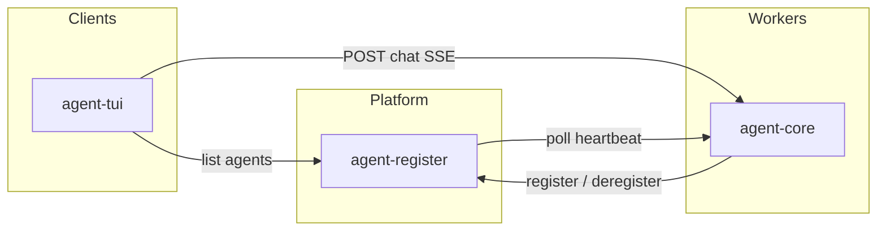

# System overview

End-to-end picture of the digital-worker monorepo: components, flows, and how they connect.

For implementation status see [build-state.md](./build-state.md). For HTTP details see [specs/](./specs/).

## What this system is

**digital-worker** is a platform for running **digital worker agents**: long-lived OS processes that:

1. Register with a central **agent-register** service so clients can discover them.
2. Expose a small HTTP API (heartbeat, chat).
3. Run a **single serial worker loop** — one LLM conversation, one inbox, one request at a time.
4. Load **identity** from workspace markdown files baked into the deployment.

Today the primary runnable worker is **agent-core**. **agent-tui** is a terminal client for chat. More agent types may follow the same protocols.

## Components

| Component | Path | Role |
|-----------|------|------|
| **agent-register** | `apps/agent-register` | Registry + heartbeat monitor |
| **agent-core** | `apps/agent-core` | LLM worker process |
| **agent-tui** | `apps/agent-tui` | Interactive terminal chat |
| **agent-register-protocol** | `packages/agent-register-protocol` | Register API types |
| **agent-core-protocol** | `packages/agent-core-protocol` | Agent API + chat SSE types |

## Registration and discovery

1. **agent-core** starts its HTTP server, then **POST**s to agent-register with its `endpoint.url`, name, purpose, and skills.
2. **agent-register** stores the agent in memory and marks it `AVAILABLE` when heartbeats succeed.
3. A **heartbeat monitor** periodically **POST**s to each agent’s `/api/v1/heartbeat`. Failures mark the agent `SLEEPING`.
4. Clients call **GET** `/api/v1/agents` and pick an agent by name or interactively.

Spec: [specs/agent-register-api.md](./specs/agent-register-api.md)

## Chat flow

1. Client sends **POST** `/api/v1/chat` with `clientId`, `prompt`, optional `sessionId`.
2. **agent-core** validates the request and **enqueues** a job on the worker inbox (does not call the LLM in the HTTP handler).
3. The **WorkerRuntime** loop dequeues jobs FIFO and runs `agent.prompt()` via [pi-agent-core](https://github.com/earendil-works/pi).
4. LLM text deltas stream back as SSE `token` events; completion sends `done` with `messageId`.

Multi-turn chat reuses the same pi `Agent` transcript: each successful prompt appends to `agent.state.messages`.

Spec: [specs/chat-streaming.md](./specs/chat-streaming.md), [specs/worker-runtime.md](./specs/worker-runtime.md)

## Worker execution model

Each **agent-core process** is exactly **one digital worker**:

- One **inbox** (FIFO queue of chat jobs).
- One **pi Agent** (conversation state).
- One **outer loop** that processes at most one LLM run at a time.
- One **command path** (`POST /api/v1/command`) for operator control that bypasses the chat inbox.

Operator commands (`/status`, `/abandon`, `/restart`, `/shutdown`) are served out-of-band. `/abandon` aborts the active LLM run and drains queued chat jobs. `/restart` deregisters and exits for relaunch (Docker uses `restart-loop.sh`; local dev spawns a replacement). Priority dequeue remains **not implemented**; see [roadmap.md](./roadmap.md).

Spec: [specs/worker-runtime.md](./specs/worker-runtime.md)

## Workspace identity

Before serving traffic, agent-core loads three files from `workspace/<agentName>/`:

| File | Mutability | Purpose |
|------|------------|---------|
| `MANDATE.md` | Immutable | Role in the solution |
| `SOUL.md` | Immutable | Style and values |
| `IDENTITY.md` | Mutable | Self-knowledge |

They are composed into the LLM system prompt. The agent may update `IDENTITY.md` via the `update_identity` tool.

Spec: [specs/workspace-identity.md](./specs/workspace-identity.md)

## Deployment units

| Environment | Doc | What runs |
|-------------|-----|-----------|
| Docker dev-workstation | [deployment/dev-workstation.md](./deployment/dev-workstation.md) | register + one agent-core |
| Local pnpm dev | [deployment/local-development.md](./deployment/local-development.md) | Same apps, no containers |

## Documentation map

- **Status:** [build-state.md](./build-state.md)
- **Why these libraries:** [architecture.md](./architecture.md)
- **Monorepo layout:** [project-structure.md](./project-structure.md)
- **Future work:** [roadmap.md](./roadmap.md)
